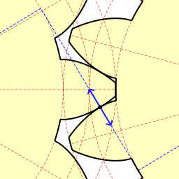

## Introducere {#introduction}

Salutare tuturor! 🙋‍♂️

În acest articol vom pune în discuție construirea și animarea evolventei unui cerc. Evolventa, vorbind cu un limbaj simplu, este o curbă care se obține prin desfășurarea imaginară de pe mosor sau înfășurarea pe mosor a unei ațe cu condiția ținerii acesteia permanent întinsă.

Evolventa este parte a profilului dintelui unei roți dințate folosite la transmisii prin angrenaje. Profilul evolventic asigură un raport de transmitere constant între roțile dințate, randament ridicat, precum și alte avantaje.

<figure>
  
  <figcaption>Raportul de transmitere constat între 2 roți dințate cu profil evolventic. Credits: <a href="https://en.wikipedia.org/wiki/Involute_gear#/media/File:Involute_wheel.gif" target="_blank" rel="noopener noreffer">Wikipedia</a></figcaption>
</figure>

Proiectarea evolventei o vom realiza cu ajutorul [LaTeX](https://en.wikipedia.org/wiki/LaTeX), sistemul de preparare a documentelor ce se folosește pe larg în mediul academic.

<figure>
    <video controls autoplay style="width: 100%;max-height: 100%;">
        <source src="./assets/involute-demo8.mp4" type="video/mp4">
    </video>
    <figcaption>Demonstrare grafică cum evolventa funcționează.</figcaption>
</figure>

\\(\LaTeX\\) este bine cunoscut pentru abilitatea sa de lucru cu texte matematice, științifice și alte lucrări complexe: documente lungi sau complicate, precum și cele multilingve. Sistemele \\(\TeX\\) produc rezultatul pe hârtie sau pe ecranul computerului cu cea mai înaltă calitate tipografică. Această calitate este crucială pentru textele complexe, unde capacitatea cititorului de a înțelege materialul depinde de claritatea cu care acesta este prezentat [^tex-friends].

Codul complet al proiectării evolventei unui cerc îl găsiți mai jos sau pe [repository-ul Github](https://github.com/sunt-programator/latex-workpapers/blob/master/involute-of-circle/involute-demo.tex). În continuare vom explica mai detaliat utilitatea fiecărei secțiuni de cod.

```latex
\documentclass[tikz,border=10pt]{standalone}

\usepackage{pgfplots,amsmath}
\pgfplotsset{compat=newest}

\begin{document}
\pgfmathsetmacro\radius{2}

% Colors
\definecolor{tangentLineColor}{HTML}{BC5090}
\definecolor{remainingArcColor}{HTML}{003F5C}
\definecolor{involuteSplineColor}{HTML}{58508D}
\definecolor{accentColor}{HTML}{FF6361}
\colorlet{dashedLineColor}{black}

% Styles
\tikzstyle{information text}=[fill=red!10,inner sep=1ex]
\pgfplotsset{
  /pgf/number format/textnumber/.style={
      fixed,
      fixed zerofill,
      precision=2,
      1000 sep={,},
    },
}

\foreach \rollAngle in {0.05,0.1,...,3.25}
  {
    \begin{tikzpicture}
      [
        point/.style = {draw, circle, fill = black, inner sep = 1pt},
        dot/.style   = {draw, circle, fill = black, inner sep = .2pt},
        declare function = {
            involutex(\radius,\psi) = \radius * (cos(\psi) + \psi * sin(\psi));
            involutey(\radius,\psi) = \radius * (sin(\psi) - \psi * cos(\psi));
            arcx(\radius,\a,\psi) = \a + \radius * cos(\psi);
            arcy(\radius,\b,\psi) = \b + \radius * sin(\psi);
          },
      ]

      \pgfmathsetmacro\rollAngleDeg{deg(\rollAngle)}
      \pgfmathsetmacro\arcLength{0.5 * \rollAngle * \radius^2}
      \pgfmathsetmacro\curvature{1 / (\radius * \rollAngle)}

      \begin{axis}[
          name=plotAxis,
          trig format=rad,
          axis equal,
          axis lines=center,
          grid=both,
          xlabel=$x$,
          ylabel=$y$,
          xmin=-5,xmax=5,
          ymin=-3,ymax=7,
          xticklabels=\empty,
          yticklabels=\empty,
        ]

        \coordinate (O) at (0,0);
        \coordinate (Or) at (\radius,0);
        \coordinate (L1) at ({arcx(\radius,0,\rollAngle)},{arcy(\radius,0,\rollAngle)});
        \coordinate (L2) at ({involutex(\radius,\rollAngle)},{involutey(\radius,\rollAngle)});

        \addplot [domain=2*pi:\rollAngle,samples=200,remainingArcColor,thick,line cap=round]({arcx(\radius,0,x)},{arcy(\radius,0,x)});
        \addplot [domain=0:\rollAngle,samples=200,dashedLineColor,dashed,line cap=round]({arcx(\radius,0,x)},{arcy(\radius,0,x)});
        \addplot [domain=0.01:\rollAngle,samples=200,involuteSplineColor,thick,line cap=round]({involutex(\radius,x)},{involutey(\radius,x)});
        \draw[tangentLineColor,thick] (L1) -- (L2);

        \draw[dashedLineColor,dashed] (O) -- (L1) node [accentColor,pos=0.5,sloped,above] {$r$};
        \addplot [domain=0:\rollAngle,samples=200,accentColor,line cap=round]({arcx(.4,0,x)},{arcy(.4,0,x)}) node[] at (.5, -.3) {$\psi$};


      \end{axis}

      \node [xshift=.5cm,below right,align=center,text width=6cm,style=information text] at (plotAxis.north east)
      {
        This is a demonstration how the {\color{accentColor} involute of a circle} works.
        So, {\color{accentColor} $r$} is radius of the circle, {\color{accentColor} $\psi$} --- roll angle,
        {\color{accentColor} $L$} --- arc length and {\color{accentColor} $k$} -- curvature of
        the involute.
        \begin{align*}
          {\color{accentColor} r}      & = const                                                  &   & = \radius                                                    \\
          {\color{accentColor} \psi}   & = \pgfmathprintnumber[textnumber]{\rollAngle}\text{ rad} &   & \approx \pgfmathprintnumber[textnumber]{\rollAngleDeg}^\circ \\
          {\color{accentColor} L}      & = \frac{1}{2} \psi r^2                                   &   & = \pgfmathprintnumber[textnumber]{\arcLength}                \\
          {\color{accentColor} \kappa} & = \frac{1}{\psi r}                                       &   & \approx \pgfmathprintnumber[textnumber]{\curvature}
        \end{align*}
      };

    \end{tikzpicture}
  }
\end{document}
```

## Setarea mediului de dezvoltare {#environment-settings}

Pentru development, vom folosi aplicația gratuită [Visual Studio Code](https://code.visualstudio.com/) în calitate de editor de cod sursă și vom crea [container Docker](https://www.docker.com/resources/what-container), în interiorul căruia vom instala și configura toate pachetele necesare pentru lucru.

Cu ajutorul editorului Visual Studio Code putem să facem development chiar în interiorul containerului 💡. Cum se configurează `devcontainers` puteți citi în acest [articol](https://code.visualstudio.com/docs/remote/containers).

### Configurarea _Dockerfile_ {#dockerfile-configuration}

Docker poate construi în mod automat imagini citind instrucțiunile dintr-un fișier `Dockerfile`. Un fișier `Dockerfile` este un document text care conține toate comenzile pe care un utilizator le-ar putea apela din linia de comandă pentru a asambla o imagine [^dockerfile-reference].

În scopul efectuării development-ului, vom folosi imaginea de bază [blang/latex](https://hub.docker.com/r/blang/latex/). Acesta va instala, compila și configura `LaTeX`. Astfel, vom avea toate pachetele LaTeX instalate în `devcontainer`-ul nostru.

Acest fișier îl vom plasa în mapa `.devcontainer` din proiectul nostru.

```dockerfile
FROM blang/latex:ubuntu

RUN apt update && apt install -y graphicsmagick ffmpeg
```

Pe lângă LaTeX, vom mai instala două pachete adiționale care se numesc [GraphicsMagick](http://www.graphicsmagick.org/) și [FFmpeg](https://ffmpeg.org/). Acestea vor servi la convertirea fișierului de ieșire `pdf`, generat de LaTex, în fișier `mp4`.

### Configurarea _devcontainer.json_ {#devcontainer-configuration}

La această etapă, vom crea fișierul `devcontainer.json` care la fel îl vom plasa în mapa `.devcontainer` din proiect. Acest fișier este utilizat pentru pentru lansarea (sau atașarea) containerului de dezvoltare (devcontainer). Acest fișier va conține și comanda pentru instalarea in VS Code a extensiei [LaTeX Workshop](https://marketplace.visualstudio.com/items?itemName=James-Yu.latex-workshop), care are ca funcționalitate completarea automată a codului, syntax highliting, compilarea documentului și multe alte funcționalități.

```json
{
  "name": "LaTeX",
  "dockerFile": "Dockerfile",
  "settings": {
    "terminal.integrated.shell.linux": "/bin/bash",
    "latex-workshop.latex.watch.usePolling": true,
    "latex-workshop.latex.autoBuild.run": "onFileChange",
    "latex-workshop.latex.autoBuild.interval": 1000,
    "latex-workshop.docker.enabled": false
  },
  "extensions": ["james-yu.latex-workshop", "adam-bender.commit-message-editor"],
  "mounts": [],
  "remoteEnv": {}
}
```

Dacă au fost efectuate configurările corecte, atunci la pornirea aplicației VS Code și la deschiderea mapei cu proiectul dat, editorul ne va propune să trecem pe `devcontainer`.

<figure>
  
  <figcaption>Visual Studio Code propune de a deschide mapa în container.</figcaption>
</figure>

## Structura de bază și preambulul documentului LaTeX {#basic-latex-settings}

Pentru început este necesar de a crea un fișier cu extensia `.tex`. Toate instrucțiunile necesare pentru construirea evolventei vor fi scrise în acesta.

Când \\(\LaTeX\\) procesează un document, el se așteaptă ca documentul să conțină o anumită structură. Astfel, fiecare document trebuie să conțină comenzile:

```latex
\documentclass{...}
\begin{document}
  ...
\end{document}
```

Între comenzile `\documentclass` și `\begin{document}` se afla așa numitul preambul. În secțiunea dată se conțin comenzile care vor afecta întregul document LaTeX. Tot aici se importă pachetele necesare și se efectuează careva setări asupra acestora.

În cazul nostru, comanda `\documentclass` mai conține câteva opțiuni, izolate între paranteze pătrate și mai specifică ce tip de clasă a documentului se va folosi, aceasta fiind izolată între acolade.

```latex
\documentclass[tikz,border=10pt]{standalone}
```

### Clasa și pachetul _standalone_ {#standalone-class}

Clasa `standalone` este proiectată pentru a crea fragmente individuale de conținut. Această clasă este utilă la generarea imaginilor care vor fi incluse în alte documente [^standalone].

Pachetul `standalone` permite utilizatorilor să plaseze cu ușurință imagini sau alt material în fișierele proprii și să le compileze de sine stătător sau ca parte a unui document principal [^standalone-package-1].

### Opțiunea și pachetul _TikZ_ {#tikz-package}

Pachetul `TikZ` este probabil cel mai complex și puternic instrument pentru crearea elementelor grafice în LaTeX. Cu acest pachet putem crea elemente grafice complexe utilizând așa elemente simple, cum ar fi linii, puncte, curbe, cercuri, dreptunghiuri, etc.

Pentru imaginile desenate cu `TikZ` este oferită o opțiune dedicată `tikz` care încarcă acest pachet și configurează mediul `tikzpicture` pentru a crea o singură pagină decupată [^standalone-package-8].

### Opțiunea _border_ {#border-option}

Opțiunea `border=10pt` specifică că documentul va avea un chenar de 10pt sau, cu alte cuvinte, va avea o margine din toate părțile de 10pt.

### Importarea pachetelor necesare {#packages-importing}

Distributivele moderne LaTeX vin cu un gama largă de pachete preinstalate. Pentru generarea evolventei ne vom folosi de pachetele `pgfplots` și `amsmath`.

```latex
\usepackage{pgfplots,amsmath}
\pgfplotsset{compat=newest}
```

Pachetul `pgfplots` este un instrument puternic, fiind bazat pe `TikZ`, care este dedicat construirii graficelor științifice. Acest pachet reprezintă un instrument de vizualizare pentru a simplifica includerea graficelor în documente. Ideea de bază este că furnizăm datele/formule și `pgfplots` face restul [^pgfplots-overleaf].

Configurarea `\pgfplotsset{compat=newest}` ne permite să utilizăm cele mai recente caracteristici ale pachetului `pgfplots`.

Pachetul `amsmath` îl voi folosi pentru alinierea formulelor matematice, însă funcționalul acestui pachet nu se limitează doar la alinierea formulelor. Cu acest pachet puteți construi matrice, fracții continue (fracții incluse în fracții), formule în chenar și [multe altele](http://ctan.mirror.ftn.uns.ac.rs/macros/latex/required/amsmath/amsldoc.pdf).

## Definirea variabilelor necesare {#colors}

```latex
\pgfmathsetmacro\radius{2}

% Colors
\definecolor{tangentLineColor}{HTML}{BC5090}
\definecolor{remainingArcColor}{HTML}{003F5C}
\definecolor{involuteSplineColor}{HTML}{58508D}
\definecolor{accentColor}{HTML}{FF6361}
\colorlet{dashedLineColor}{black}

% Styles
\tikzstyle{information text}=[fill=red!10,inner sep=1ex]
\pgfplotsset{
 /pgf/number format/textnumber/.style={
  fixed,
  fixed zerofill,
  precision=2,
  1000 sep={,},
 },
}
```

În secțiunea dată setăm raza cercului. Toate calculele ulterioare for fi în bază de valoarea setată la variabila `radius`.

Ulterior, setăm culorile necesare pentru fiecare strat desenat pe graficul nostru. Aici se folosește pachetul `xcolor`. Dar de ce nu l-am importat în preambul? Acest pachet nu trebuie în cazul nostru de importat din motiv că `tikz` deja îl utilizează. Profit 🙂!

În ultimele comenzi din această secțiune se setează un stil cu denumirea `information text` ce va avea 10% intensitate din culoarea roșie și mai setează precizia părții fracționare a calculelor de 2 cifre.

## Construirea graficelor evolventei {#involute-plotting-contruction}

Ca să construim animația evolventei unui cerc, vom proceda astfel. Prin comanda `\foreach` vom desena cadru după cadru câte un grafic unde ca valoare de iterație va fi unghiul de depanare a evolventei. Cu alte cuvinte, în fișierul de ieșire `pdf` vom avea în fiecare pagină a câte un grafic.

```latex
\foreach \rollAngle in {0.05,0.1,...,3.25}
{
  ...
}
```

Pentru construirea evolventei vom folosi `radiani` în loc de `grade`. În ciclul `foreach` vedem că unghiul de depanare începe de la \\( \psi_a = 0.05 rad \\) și se termină cu \\( \psi_b = 3.25 rad \\). Pasul de la iterație la iterație este de \\( \psi_i = 0.05 rad \\). Putem cu aceste date prealabil să calculăm numărul de cadre care vor fi în final.

$$
\frac{\psi_b - \psi_a}{\psi_i} = \frac{3.25 - 0.05}{0.05} = 64
$$

### Setări generale ale mediului `tikzpicture` la fiecare iterație {#tikzpicture}

Comenzile de desenare `tikz` (inclusiv și `pgfplots`) trebuie să fie incluse într-un mediu `tikzpicture`.

```latex
\begin{tikzpicture}
    [
    declare function = {
        involutex(\radius,\psi) = \radius * (cos(\psi) + \psi * sin(\psi));
        involutey(\radius,\psi) = \radius * (sin(\psi) - \psi * cos(\psi));
        arcx(\radius,\a,\psi) = \a + \radius * cos(\psi);
        arcy(\radius,\b,\psi) = \b + \radius * sin(\psi);
        },
    ]
    ...
\end{tikzpicture}
```

Ca opțiune a mediului `tikzpicture` vom determina funcțiile necesare pentru construirea graficelor. În cod vedem 4 funcții însă în realitate merge vorba de doar două, deoarece în pereche acestea alcătuiesc ecuații parametrice.

> În matematică, o ecuație parametrică definește un grup de cantități ca funcții ale uneia sau mai multor variabile independente numite parametri. Ecuațiile parametrice sunt utilizate în mod obișnuit pentru a exprima coordonatele punctelor care alcătuiesc un obiect geometric, cum ar fi o curbă sau o suprafață, caz în care ecuațiile sunt denumite colectiv reprezentare parametrică sau parametrizare a obiectului [^parametric-equation-wiki].

Ecuațiile parametrice pentru reprezentarea grafică a evolventei sunt indicate mai jos, unde \\(r\\) este raza cercului și \\(\psi\\) -- unghiul de "depanare a aței de pe mosor" 😄.

$$
x = r(\cos\psi + \psi\sin\psi)
$$

$$
y = r(\sin\psi - \psi\cos\psi)
$$

Celelalte două ecuații parametrice le vom folosi pentru a desena arcuri de cerc pe grafic, unde \\(r\\) iarăși este raza cercului, \\(\psi\\) -- unghiul arcului de cerc, iar \\(x_0\\) și \\(y_0\\) sunt coordonatele centrului cercului, în cazul în care acesta nu se află în origine.

$$
x = x_0 + r \cos\psi
$$

$$
y = y_0 + r \sin\psi
$$

### Adaugarea variabilelor suplimentare {#additional-variables}

La fiecare iterație vor fi efectuate câteva calcule, rezultatele cărora vor fi salvate în variabile. Aceste variabile vor fi utile în continuare pentru afișarea textuală a rezultatelor calculelor.

```latex
\pgfmathsetmacro\rollAngleDeg{deg(\rollAngle)}
\pgfmathsetmacro\arcLength{0.5 * \rollAngle * \radius^2}
\pgfmathsetmacro\curvature{1 / (\radius * \rollAngle)}
```

Prima variabilă `rollAngleDeg` va conține valoarea unghiului de depanare exprimată în grade.

Ulterior vom salva lungimea arcului evolventei în variabila `arcLength`. Aceasta are următoarea formulă:

$$
L = \frac{1}{2} \psi r^2
$$

În final, vom calcula curbarea și vom salva valoarea acesteia în variabila `curvature`. Formula pentru calcularea acesteia este următoarea:

$$
\kappa = \frac{1}{\psi r}
$$

### Setări generale ale axelor graficului fiecărui cadru {#general-frame-settings}

Declarația de mediu `\begin {axis}` și `\end {axis}` va seta scalarea corectă a graficului. Noi vom folosi scalarea simplă liniară, însă acest pachet are și [alte tipuri](https://www.overleaf.com/learn/latex/pgfplots_package#Reference_guide) de scalări, pe care le puteți folosi la proiectarea altor grafice.

```latex
\begin{axis}[
    name=plotAxis,
    trig format=rad,
    axis equal,
    axis lines=center,
    grid=both,
    xlabel=$x$,
    ylabel=$y$,
    xmin=-5,xmax=5,
    ymin=-3,ymax=7,
    xticklabels=\empty,
    yticklabels=\empty,
]
    ...
\end{axis}
```

După cum observăm, axele au un șir de opțiuni atribuite. În mod succint vom desfășura semnificația și utilitatea acestora.

<figure>
  
  <figcaption>Grafic cu axe localizate în centru, scalare liniară.</figcaption>
</figure>

#### Opțiunea _name_ {#name-option}

Opțiunea `name` setează numele graficului. Această opțiune ne va permite, accesând graficul după nume, să poziționăm în dreapta acestuia o casetă informativă cu toate calculele evolventei la fiecare iterație.

#### Opțiunea _trig format=rad_ {#rad-format-option}

Pachetul `pgfplots` în mode implicit operează cu `grade`, atunci când avem calcule ce conțin funcții trigonometrice. Pentru proiectarea evolventei vom utiliza `radiani`. Opțiunea `trig format` permite reconfigurarea formatului de intrare pentru funcții trigonometrice precum `sinus`, `cosinus`, `tangentă`, etc [^pgfplots-ctan-56].

#### Opțiunea _axis equal_ {#axis-option}

Cu ajutorul opțiunii `axis equal`, fiecare vector de unitate este setat la aceeași lungime, în timp ce dimensiunile axei rămân constante. După aceea, raporturile de mărime pentru fiecare unitate în `x` și `y` vor fi aceleași. Limitele axei vor fi extinse pentru a compensa efectul de scalare [^pgfplots-ctan-298].

#### Opțiunea _axis lines=center_ {#axis-lines-option}

În mod implicit, liniile de axe sunt desenate ca o casetă, însă este posibil de modificat aspectul liniilor axelor `x` și `y`. Atribuirea unei valori din cele disponibile, va permite alegerea locației pentru liniile axelor graficului [^pgfplots-ctan-270-271].

Noi vom seta valoarea `center`, ceea ce va însemna că axele se vor intersecta în coordonata `0` (origine).

#### Opțiunea _grid=both_ {#grid-option}

Această opțiune va desena liniile de grilă pe grafic.

#### Opțiunile _xlabel_ și _ylabel_ {#labels-options}

Aceste opțiuni vor desena etichetele axelor graficului, adică textul `x` și `y`. Simbolul `$` specifică că textul reprezintă o formulă matematică.

#### Opțiunile _xmin_, _xmax_, _ymin_ și _ymax_ {#plot-limits-options}

Aceste opțiuni permit definirea limitelor axelor, adică colțul din stânga jos și cel din dreapta sus. Tot conținutul ce se va afla în afara acestor limite va fi eliminat [^pgfplots-ctan-327].

#### Opțiunile _xticklabels_ și _yticklabels_ {#tick-labels-options}

Aceste opțiuni permit atribuirea etichetelor pentru fiecare pas a axei (segmente ale axelor). În cazul nostru, nu avem nevoie de etichetele cu numerotarea fiecărui segment al axelor. Pentru aceasta, vom seta la aceste opțiuni valoarea `\empty` (gol).

### Adăugarea coordonatelor necesare pe grafic {#coordonates}

În continuare, vom adăuga 3 coordonate pe grafic, și anume \\(O\\), \\(L_1\\) și \\(L_2\\). Aceste coordonate ne vor permite să trasăm segmente.

Sintaxa de adăugare a coordonatei pe grafic este următoarea:

`\coordonate[<options>] (<name>) at (<coordonate>);`

Deci, coordonatele \\(O\\), \\(L_1\\) și \\(L_2\\) vor fi adaugate astfel:

```latex
\coordonate (O) at (0,0);
\coordonate (L1) at ({arcx(\radius,0,\rollAngle)},{arcy(\radius,0,\rollAngle)});
\coordonate (L2) at ({involutex(\radius,\rollAngle)},{involutey(\radius,\rollAngle)});
```

Segmentul \\(OL_1\\) va reprezenta raza cercului, iar unghiul dintre acest segment și segmentul \\([0,r]\\) va fi însăși unghiul de depanare.

Segmentul \\(L_1L_2\\) va reprezenta tangenta cercului, pornind de la perpendiculară spre punctul maxim al evolventei (calculând valorile ecuațiilor parametrice, unde \\(\psi\\) va fi egal cu valoarea curentă a variabilei `\rollAngle`).

<figure>
  
  <figcaption>Coordonatele \\(O\\), \\(L_1\\) și \\(L_2\\) pe grafic.</figcaption>
</figure>

### Proiectarea arcului de cerc rămas după depanare {#remaining-arc-circle-plot}

Fiindcă am menționat că evolventa o putem reprezenta ca depanarea aței de pe mosor, atunci la fiecare iterație vom elimina o parte din cerc care corespunde cu unghiul `\rollAngle`.

<figure>
    <video controls style="width: 70%;max-height: 100%;">
        <source src="./assets/involute-demo2.mp4" type="video/mp4">
    </video>
    <figcaption>Arcul de cerc rămas după depanare.</figcaption>
</figure>

Comanda `\addplot` este principala comandă de construire a graficelor, disponibilă în fiecare mediu de axe. Aceasta poate fi folosită de una sau mai multe ori în cadrul axelor pentru a adăuga mai multe grafice [^pgfplots-ctan-43].

Sintaxa de adaugare a graficului pe axe este următoarea:

```latex
\addplot[<options>] <input data> <trailing path commands>;
```

Deci, pentru a construi graficul cu arcul de cerc rămas după depanare, vom scrie următoarea comandă:

```latex
\addplot [domain=2*pi:\rollAngle,samples=200,remainingArcColor,thick,line cap=round]({arcx(\radius,0,x)},{arcy(\radius,0,x)});
```

Opțiunile setate la construirea graficului le vom desfășura în continuare, excepție fiind `remainingArcColor`. Această opțiune doar setează culoarea graficului cu cea declarată [în una din secțiunile anterioare](#colors).

#### Opțiunea _domain_ {#domain-option}

Această opțiune ne permite de a seta domeniul de definiție al funcției. Expresiile graficelor bidimensionale sunt definite ca funcții \\(f: [x_1,x_2] \to \mathbb{R}\\) și \\(\langle x_1 \rangle\\) și \\(\langle x_2 \rangle\\) sunt setate cu opțiunea `domain` [^pgfplots-ctan-55].

În cazul nostru, domeniul de definiție este \\(f: [2\pi:\psi] \to \mathbb{R}\\), unde \\(\psi\\) este unghiul curent de depanare, egal cu valoarea variabilei `\rollAngle`.

Cu alte cuvinte, de la iterație la iterație cercul va pierde o parte din el. Unghiul arcului de cerc eliminat din cerc va corespunde cu valoarea `\rollAngle`.

#### Opțiunea _samples_ {#samples-option}

Această opțiune setează numărul de puncte de prelevare (sample points) [^pgfplots-ctan-56]. Este de menționat că aceste prelevări se vor conține în domeniul de definiție setat anterior.

#### Stilul TikZ _thick_ {#thick-option}

Această stil permite setarea lățimii liniei graficului. Stilul `thick`, pe care l-am selectat, corespunde cu lățimea de linie `0.8pt` [^tikz-wikibooks-line-width].

TikZ oferă lățimi de linie predefinite, după cum urmează [^pgfplots-ctan-190]:

- thin
- ultra thin
- very thin
- semithick
- thick
- very thick
- ultra thick

#### Opțiunea _line cap_ {#line-cap-option}

Această opțiune specifică modul în care liniile "se termină". Tipurile permise sunt `round`, `rect` și `butt`. Acestea au următoarele efecte [^tikz-ctan-175]:

<figure>
  
  <figcaption>Tipurile de terminații ale liniilor. Credits: <a href="http://ctan.mirror.ftn.uns.ac.rs/graphics/pgf/base/doc/pgfmanual.pdf" target="_blank" rel="noopener noreffer">CTAN</a></figcaption>
</figure>

Pentru reprezentarea grafică a tuturor ecuațiilor parametrice, vom folosi terminații de linii rotunjite, adică vom folosi opțiunea `line cap=round`.

În mod similar, cu aceste opțiuni descrise, vom construi și celelalte grafice.

### Proiectarea arcului de cerc depanat {#remaining-arc-of-circle-plotting}

Prin comanda de mai jos, vom construi la fiecare iterație un arc de cerc punctat (opțiunea `dashedLineColor`), care va reprezenta unghiul de depanare al evolventei pe cerc.

Acest arc de cerc va avea domeniul de definiție exact invers cu cel [anterior](#domain-option), adică \\(f: [0:\psi] \to \mathbb{R}\\).

```latex
\addplot [domain=0:\rollAngle,samples=200,dashedLineColor,dashed,line cap=round]({arcx(\radius,0,x)},{arcy(\radius,0,x)});
```

Ca rezultat, vizual vom avea un singur cerc care de fapt constă din două arcuri de cerc opuse, cu culori și stiluri diferite.

<figure>
    <video controls style="width: 70%;max-height: 100%;">
        <source src="./assets/involute-demo3.mp4" type="video/mp4">
    </video>
    <figcaption>Proiectarea arcului de cerc depanat.</figcaption>
</figure>

### Proiectarea evolventei {#involute-plotting}

Iată am ajuns și la cel mai important punct. Aici vom construi evolventa propriu-zisă. La construirea acesteia vom folosi ecuațiile parametrice discutate anterior [anterior](#tikzpicture).

```latex
\addplot [domain=0.01:\rollAngle,samples=200,involuteSplineColor,thick,line cap=round]({involutex(\radius,x)},{involutey(\radius,x)});
```

Ca rezultat, obținem profilul evolventei:

<figure>
    <video controls style="width: 70%;max-height: 100%;">
        <source src="./assets/involute-demo4.mp4" type="video/mp4">
    </video>
    <figcaption>Profilul evolventei pe grafic.</figcaption>
</figure>

### Proiectarea liniei ce unește tangenta cu capătul evolventei {#line-plotting}

Următorul pas va fi trasarea liniei care unește tangenta cu capătul evolventei.

Acest lucru îl vom realiza cu ajutorul comenzii `\draw`. Această linie va avea culoarea atribuită în variabila `tangentLineColor`, lățimea liniei va fi de tip `thick` și va avea coordonatele `L1` și `L2` care le-am declarat și inițializat în [una din secțiunile precedente](#coordonates).

```latex
\draw[tangentLineColor,thick] (L1) -- (L2);
```

Linia aceasta va reprezenta acea "ață", pe care o depănăm de pe mosor 🧵. Rezultatul arată astfel:

<figure>
    <video controls style="width: 70%;max-height: 100%;">
        <source src="./assets/involute-demo5.mp4" type="video/mp4">
    </video>
    <figcaption>Linia ce unește tangenta cu capătul evolventei.</figcaption>
</figure>

### Proiectarea razei cercului {#radius-line-plotting}

Tot cu aceeași sintaxă vom proiecta raza cercului care se va roti odată cu mărirea unghiului de depanare.

```latex
\draw[dashedLineColor,dashed] (O) -- (L1) node [accentColor,pos=0.5,sloped,above] {\\(r\\)};
```

Rezultatul îl putem vedea în animația de mai jos, însă opțiunile pe care le-am setat la nod, le vom desfășura în secțiunile următoare.

<figure>
    <video controls style="width: 70%;max-height: 100%;">
        <source src="./assets/involute-demo6.mp4" type="video/mp4">
    </video>
    <figcaption>Proiectarea razei cercului.</figcaption>
</figure>

#### Opțiunea _/tikz/pos_ {#pos-option}

Opțiunea `/tikz/pos=<fraction>` ancorează nodul pe un anumit punct de pe linie de la coordonata anterioară la acea actuală. `<fraction>` dictează cât de "departe" trebuie să fie punctul pe linie. `<fraction>` setat ca \\(0\\) reprezintă coordonata anterioară, \\(1\\) este cea curentă, iar toate celelalte valori vor fi între ele. În special, \\(0.5\\) reprezintă mijlocul liniei [^tikz-ctan-246].

Noi vom seta valoarea \\(0.5\\), ceea ce va însemna că nodul se afla la mijloc de linie. Același lucru îl putem face cu opțiunea `/tikz/midway`, care este echivalentul opțiunii `pos=0.5`.

#### Opțiunea _/tikz/sloped_ {#slopped-option}

Opțiunea `/tikz/sloped` face ca nodul să fie rotit, astfel încât linia orizontală a acestuia să devină tangentă cu curba. Rotirea de obicei se face în așa mod, încât textul să nu fie niciodată "cu susul în jos". [^tikz-ctan-248].

<figure>
  
  <figcaption>Opțiunea `/tikz/sloped` din pachetul TikZ. Credits: <a href="http://ctan.mirror.ftn.uns.ac.rs/graphics/pgf/base/doc/pgfmanual.pdf" target="_blank" rel="noopener noreffer">CTAN</a></figcaption>
</figure>

În cazul nostru avem nu o curbă, ci o linie și textul trebuie să se rotească odată cu rotirea liniei. La momentul când unghiul de depanare va depăși \\(\frac{\pi}{2}\\) radiani sau \\(90^{\circ}\\), această opțiune nu va permite ca textul să fie inversat (cu susul în jos).

#### Opțiunea _/tikz/above_ {#above-option}

Această opțiune este echivalentă cu opțiunea `/tikz/anchor=south` și permite poziționarea nodului deasupra liniei.

### Proiectarea unghiului arcului de cerc depanat {#involute-angle-plotting}

La această etapă, vom proiecta unghiul arcului de cerc depanat. Pentru aceasta, vom utiliza comanda `\addplot`, sintaxa căreia am desfășurat-o în una din [secțiunile anterioare](#remaining-arc-circle-plot). Unica diferență este că aici adăugăm un nod fix poziționat în punctul \\((0.5,-0.3)\\) cu textul \\(\psi\\).

```latex
\addplot [domain=0:\rollAngle,samples=200,accentColor,line cap=round]({arcx(.4,0,x)},{arcy(.4,0,x)}) node[] at (.5, -.3) {$\psi$};
```

Desigur că \\(\LaTeX\\) dispune de o gamă largă de pachete pentru desenarea unghiurilor (cum ar fi pachetul [tkz-euclide](http://ctan.mirror.ftn.uns.ac.rs/macros/latex/contrib/tkz/tkz-euclide/doc/TKZdoc-euclide.pdf)), însă vom merge pe calea proiectării aceluiași arc de cerc, numai că cu o rază mai mică.

<figure>
    <video controls style="width: 70%;max-height: 100%;">
        <source src="./assets/involute-demo7.mp4" type="video/mp4">
    </video>
    <figcaption>Proiectarea unghiului depanării evolventei.</figcaption>
</figure>

### Afișarea parametrilor evolventei la fiecare iterație {#involute-parameters-drawing}

Parametrii evolventei la fiecare iterație vor fi poziționați într-o casetă, ultima fiind poziționată în dreapta graficului nostru.

<figure>
    <video controls autoplay style="width: 100%;max-height: 100%;">
        <source src="./assets/involute-demo8.mp4" type="video/mp4">
    </video>
    <figcaption>Afișarea parametrilor evolventei la fiecare iterație.</figcaption>
</figure>

Codul casetei cu parametrii evolventei îl putem vedea mai jos:

```latex
\node [xshift=.5cm,below right,align=center,text width=6cm,style=information text] at (plotAxis.north east)
{
    This is a demonstration how the {\color{accentColor} involute of a circle} works.
    So, {\color{accentColor} $r$} is radius of the circle, {\color{accentColor} $\psi$} --- roll angle,
    {\color{accentColor} $L$} --- arc length and {\color{accentColor} $k$} -- curvature of
    the involute.
    \begin{align*}
        {\color{accentColor} r}      & = const                                                  &   & = \radius                                                    \\
        {\color{accentColor} \psi}   & = \pgfmathprintnumber[textnumber]{\rollAngle}\text{ rad} &   & \approx \pgfmathprintnumber[textnumber]{\rollAngleDeg}^\circ \\
        {\color{accentColor} L}      & = \frac{1}{2} \psi r^2                                   &   & = \pgfmathprintnumber[textnumber]{\arcLength}                \\
        {\color{accentColor} \kappa} & = \frac{1}{\psi r}                                       &   & \approx \pgfmathprintnumber[textnumber]{\curvature}
    \end{align*}
};
```

Această porțiune de cod de la prima vedere pare a fi dificilă. În secțiunile ulterioare vom explica unele momente-cheie ce au loc în acest fragment de cod.

#### Commanda _\node_ {#node-command}

Nodurile sunt probabil cele mai universale elemente din `TikZ`. Un nod este de obicei un dreptunghi sau un cerc sau o altă formă simplă cu un text pe el. În cel mai simplu caz, un nod este doar un text care este plasat la o anumită coordonată.

```latex
\node[<options>](<name>) at (<coordinate>){<text>};
```

În cazul nostru, vom crea un nod cu coordonata localizată în colțul drept sus al graficului principal. Acest lucru se realizează prin referirea către numele axei graficului principal, cu indicarea ancorei (punctului de referință a nodului) în poziția nord-est.

<figure>
  
  <figcaption>Ancore poziționate pe caseta de delimitare a axei din pachetul TikZ. Credits: <a href="http://ctan.mirror.ftn.uns.ac.rs/graphics/pgf/contrib/pgfplots/doc/pgfplots.pdf" target="_blank" rel="noopener noreffer">CTAN</a></figcaption>
</figure>

Opțiunea `xshift=.5cm` permite de a executa translația casetei pe axa \\(x\\) cu `0.5cm`, `below right` -- poziționarea casetei în dreapta sub coordonata setată anterior și cu luarea în considerare a translației efectuate.

Opțiunea `/tikz/text width=6cm` va plasa textul nodului într-o casetă de `6cm` lățime. Dacă lățimea textului va depăși această limită, atunci se va întrerupe linia și se va trece conținutul rămas din rând nou.

În ceea ce privește opțiunea `/tikz/align=center`, aceasta este utilizată pentru a configura alinierea textului cu mai multe linii în interiorul unui nod. Dacă opțiunea `/tikz/text width` este setată la o anumită lățime (să numim această aliniere cu line breaking), opțiunea de aliniere va configura `\leftskip` și `\rightskip` în așa fel încât textul să fie întrerupt și aliniat în funcție de opțiunea de aliniere [^tikz-ctan-235].

Opțiunea `style=information text` permite de a seta stilul pe care l-am identificat [în una din secțiunile anterioare](#colors). Această casetă cu parametrii evolventei la fiecare iterație va avea o culoare de fundal roșie cu intensitatea de 10% din culoarea de bază.

#### Afișarea textului color {#colored-text-drawing}

Pentru afișarea unui text color în nod, putem utiliza sintaxa de mai jos, denumirile culorilor fiind identificate [în primele secțiuni](#colors).

```latex
{\color{accentColor} some text}
```

#### Alinierea formulelor matematice din casetă {#formulas-drawing}

Formulele matematice nu vor fi aliniate într-o formă simplă (stânga, centru, dreapta), ci va avea o formă complexă. Alinierea se va face la simbolul `=`, cu alte cuvinte toate cele 4 formule se vor poziționa una sub alta cu alinierea strict la acest simbol.

<figure>
  
  <figcaption>Alinierea formulelor matematice după simbolul egal.</figcaption>
</figure>

Acest lucru se face cu ajutorul pachetului `amsmath`, folosind construcția `\begin{align*} ... \end{align*}` și determinând prin simbolul `&` locul unde avem nevoie să aliniem ecuația.

```latex
\begin{align*}
    {\color{accentColor} r} & = const & & = \radius \\
\end{align*}
```

Despre semnificația și utilitatea simbolului `&` în acest pachet puteți citi [aici](https://tex.stackexchange.com/a/159724).

## Producerea fișierului de ieșire final cu animarea evolventei {#file-output-and-animation}

Dat fiind faptului că lucrăm în `devContainer`, deja avem toate pachetele instalate pentru convertirea fișierului `pdf` în `mp4` (fișier video cu animarea evolventei). Era posibilă convertirea în fișier `gif` dar acest format este unul învechit și are [o serie de dezavantaje](https://connectusfund.org/6-advantages-and-disadvantages-of-animated-gifs).

Există o mulțime de formate mai performante, cum ar fi [webp](https://en.wikipedia.org/wiki/WebP), [apng](https://en.wikipedia.org/wiki/APNG) și altele. Nu vom folosi aceste formate, fiindcă problema constă în compatibilitate. Aceste formate nu sunt suportate pe deplin de toate browserele (exemplu pentru [apng](https://caniuse.com/#feat=apng), [webp](https://caniuse.com/#feat=webp)).

Cea mai optimă variantă este `mp4`. Acest format și codecul `H.264` este suportat practic de [toate browserele](https://caniuse.com/#feat=mpeg4). Putem seta și opțiunea [loop](https://www.geeksforgeeks.org/html-video-loop-attribute/) pentru repetarea ciclică a video-ului și, astfel, vom obține același efect ca și în cazul unui fișier de tip `gif`.

Prima etapă este convertirea fișierului `pdf` generat de LaTeX într-o secvență de imagini cu ajutorul pachetului [GraphicsMagick](http://www.graphicsmagick.org/). Cu alte cuvinte, fiecare foaie din fișier va fi salvată în imagini distincte cu extensia `png`.

Pentru a realiza această convertire, ne vom folosi de comanda de mai jos, care va salva secvențe de imagini cu densitatea de `300 DPI` și fundal alb.

```bash
mkdir involute-of-circle/output/

gm convert -density 300 involute-of-circle/involute-demo.pdf -background white +adjoin involute-of-circle/output/image_%02d.png

# Alternativă folosind pachetul Ghostscript
gs -sDEVICE=pngalpha -o involute-of-circle/output/image_%02d.png -r300 involute-of-circle/involute-demo.pdf
```

Următorul pas este convertirea secvenței de imagini în fișier video de tip `mp4`. Pentru aceasta, ne vom folosi de pachetul preinstalat in container care se numește [FFmpeg](https://ffmpeg.org/).

```bash
ffmpeg -r 15 -i involute-of-circle/output/image_%02d.png -c:v libx264 -vf fps=60 -pix_fmt yuv420p -vf "pad=ceil(iw/2)*2:ceil(ih/2)*2" involute-of-circle/output/out.mp4
```

## Concluzie {#conclusion}

\\(\LaTeX\\) este un sistem avansat de preparare a documentului. Acesta dispune de un număr larg de pachete care permit realizarea unor sarcini complexe.

În acest articol am folosit pachetul `PGFPlots` (care la rândul său foloseste pachetul `TikZ`), pentru a proiecta evolventa unui cerc.

Animarea evolventei am realizat-o cu ajutorul ciclului `foreach`, unde la fiecare iterație am modificat unghiul de depanare. Ca rezultat am obținut un fișier `pdf` cu cadrele necesare pentru animare. Ulterior, acest fișier l-am convertit în fișier `mp4` cu ajutorul pachetului [GraphicsMagick](http://www.graphicsmagick.org/).

<figure>
    <video controls autoplay style="width: 100%;max-height: 100%;">
        <source src="./assets/involute-demo8.mp4" type="video/mp4">
    </video>
    <figcaption>Rezultatul final.</figcaption>
</figure>

Experimentând cu evolvente, putem obține astfel de figuri:

<figure>
  
  <figcaption>Experimente cu evolvente.</figcaption>
</figure>

Codul deplin se află pe [repository Github](https://github.com/sunt-programator/latex-workpapers).

[^standalone]: [Standalone: class vs package. StackOverflow](https://tex.stackexchange.com/a/287559)
[^standalone-package-1]: Martin Scharrer. The standalone Package, v1.3a din 26.03.2018, p.1. Credits: [CTAN](http://mirrors.ibiblio.org/CTAN/macros/latex/contrib/standalone/standalone.pdf)
[^standalone-package-8]: Martin Scharrer. The standalone Package, v1.3a din 26.03.2018, p.8. Credits: [CTAN](http://mirrors.ibiblio.org/CTAN/macros/latex/contrib/standalone/standalone.pdf)
[^tikz-ctan-175]: Till Tantau și alti autori. TikZ & PGF. Manual for Version 3.1.5b, v3.1.5b din 08.01.2020, p.175. Credits: [CTAN](http://ctan.mirror.ftn.uns.ac.rs/graphics/pgf/base/doc/pgfmanual.pdf)
[^tikz-ctan-235]: Till Tantau și alti autori. TikZ & PGF. Manual for Version 3.1.5b, v3.1.5b din 08.01.2020, p.235. Credits: [CTAN](http://ctan.mirror.ftn.uns.ac.rs/graphics/pgf/base/doc/pgfmanual.pdf)
[^tikz-ctan-246]: Till Tantau și alti autori. TikZ & PGF. Manual for Version 3.1.5b, v3.1.5b din 08.01.2020, p.246. Credits: [CTAN](http://ctan.mirror.ftn.uns.ac.rs/graphics/pgf/base/doc/pgfmanual.pdf)
[^tikz-ctan-248]: Till Tantau și alti autori. TikZ & PGF. Manual for Version 3.1.5b, v3.1.5b din 08.01.2020, p.248. Credits: [CTAN](http://ctan.mirror.ftn.uns.ac.rs/graphics/pgf/base/doc/pgfmanual.pdf)
[^pgfplots-overleaf]: Pgfplots package. Credits: [Overleaf](https://www.overleaf.com/learn/latex/pgfplots_package)
[^pgfplots-ctan-43]: Dr. Christian Feuersänger. Manual for Package pgfplots, v1.17 din 29.02.2020, p.43. Credits: [CTAN](http://ctan.mirror.ftn.uns.ac.rs/graphics/pgf/contrib/pgfplots/doc/pgfplots.pdf)
[^pgfplots-ctan-56]: Dr. Christian Feuersänger. Manual for Package pgfplots, v1.17 din 29.02.2020, p.56. Credits: [CTAN](http://ctan.mirror.ftn.uns.ac.rs/graphics/pgf/contrib/pgfplots/doc/pgfplots.pdf)
[^pgfplots-ctan-270-271]: Dr. Christian Feuersänger. Manual for Package pgfplots, v1.17 din 29.02.2020, p.270-271. Credits: [CTAN](http://ctan.mirror.ftn.uns.ac.rs/graphics/pgf/contrib/pgfplots/doc/pgfplots.pdf)
[^pgfplots-ctan-298]: Dr. Christian Feuersänger. Manual for Package pgfplots, v1.17 din 29.02.2020, p.298. Credits: [CTAN](http://ctan.mirror.ftn.uns.ac.rs/graphics/pgf/contrib/pgfplots/doc/pgfplots.pdf)
[^pgfplots-ctan-327]: Dr. Christian Feuersänger. Manual for Package pgfplots, v1.17 din 29.02.2020, p.327. Credits: [CTAN](http://ctan.mirror.ftn.uns.ac.rs/graphics/pgf/contrib/pgfplots/doc/pgfplots.pdf)
[^pgfplots-ctan-55]: Dr. Christian Feuersänger. Manual for Package pgfplots, v1.17 din 29.02.2020, p.55. Credits: [CTAN](http://ctan.mirror.ftn.uns.ac.rs/graphics/pgf/contrib/pgfplots/doc/pgfplots.pdf)
[^pgfplots-ctan-190]: Dr. Christian Feuersänger. Manual for Package pgfplots, v1.17 din 29.02.2020, p.190. Credits: [CTAN](http://ctan.mirror.ftn.uns.ac.rs/graphics/pgf/contrib/pgfplots/doc/pgfplots.pdf)
[^parametric-equation-wiki]: Parametric equation. Credits: [Wikipedia](https://en.wikipedia.org/wiki/Parametric_equation)
[^tikz-wikibooks-line-width]: LaTeX/PGF/TikZ. Line width. Credits: [Wikibooks](https://en.wikibooks.org/wiki/LaTeX/PGF/TikZ#Line_width)
[^dockerfile-reference]: Dockerfile reference. Credits: [docs.docker.com](https://docs.docker.com/engine/reference/builder/)
[^tex-friends]: What are TEX and its friends? Credits: [CTAN](https://www.ctan.org/tex)
